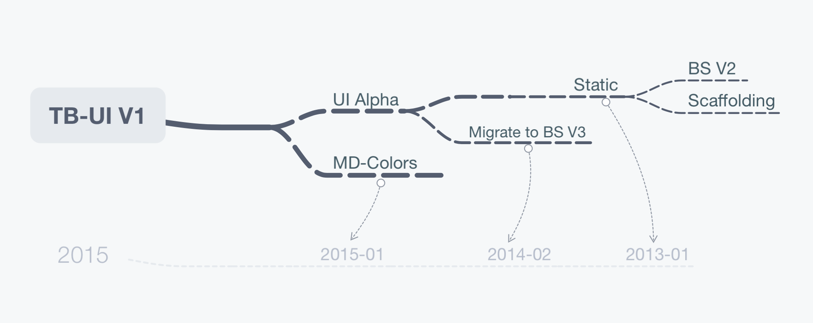

## Teambition UI System
A pithy and realistic way to combine design and code. The all-in-one UIS actually is flexible, it can not only improve efficiency with the unified design, but also make program more lightweight.

## Composition
Why do we call it "system", but not "collection"?

Because it has a natural and intuitive composition that organizes assets and libraries.

There is a list of all matters below:

### Atoms
- [TB-Icons](https://github.com/teambition/TB-Icons)
- [TB-Colors](https://github.com/teambition/TB-Colors)

### Molecules
- [TB-Styles](https://github.com/teambition/TB-Styles)
- [TB-MStyles](https://github.com/teambition/TB-MStyles) [Todo]

### Materials
- [TB-UIKit](https://github.com/teambition/TB-UIKit) **[WIP]**
- [TB-MUIKit](https://github.com/teambition/TB-MUIKit) [Todo]

### Goods
- [TB-MViews](https://github.com/teambition/TB-MViews) [Todo]

### Mediums
- [TB-Linter](https://github.com/teambition/TB-Linter)
- [Teambition Standards](https://github.com/teambition/standard)

## Benefits
Literally, you can't directly use the matters which are not the general style in your non-tb project after installing them with NPM.

We really hope that you get very inspired by our experiences and save some time for your next amazing project.

## Timeline
### 2016
- 07-26: The plan changed suddenly, [TB-UIKit](https://github.com/teambition/TB-UIKit) was top priority. **[Current Stage]**
- 06-30: Project summary in the first half-year, not enough spare time to work on it : (
- 03-28: The first molecule ([TB-Styles](https://github.com/teambition/TB-Styles)) was synthesized.
- 02-22: Got an idea for new UI when Sune met Jaky.

### 2015 ~ 2013

`TB-UI V1` was just a customized UI Kit based on Bootstrap, only for use in Teambition SPA.

## Team
- [@SuneBear](https://github.com/SuneBear) - Teambition [Frontend](https://www.sitepoint.com/spelling-frontend-front-end-front-etc/) Developver
- [@Zitian770](https://github.com/Zitian770) - Teambition UI Designer

## Contribution
Have an idea or feedback? Warmly welcome to join us on GitHub for a more graceful system.

## License
Licensed under the [MIT](./LICENSE) License.
